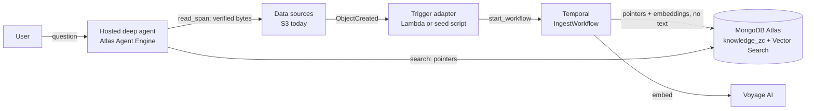
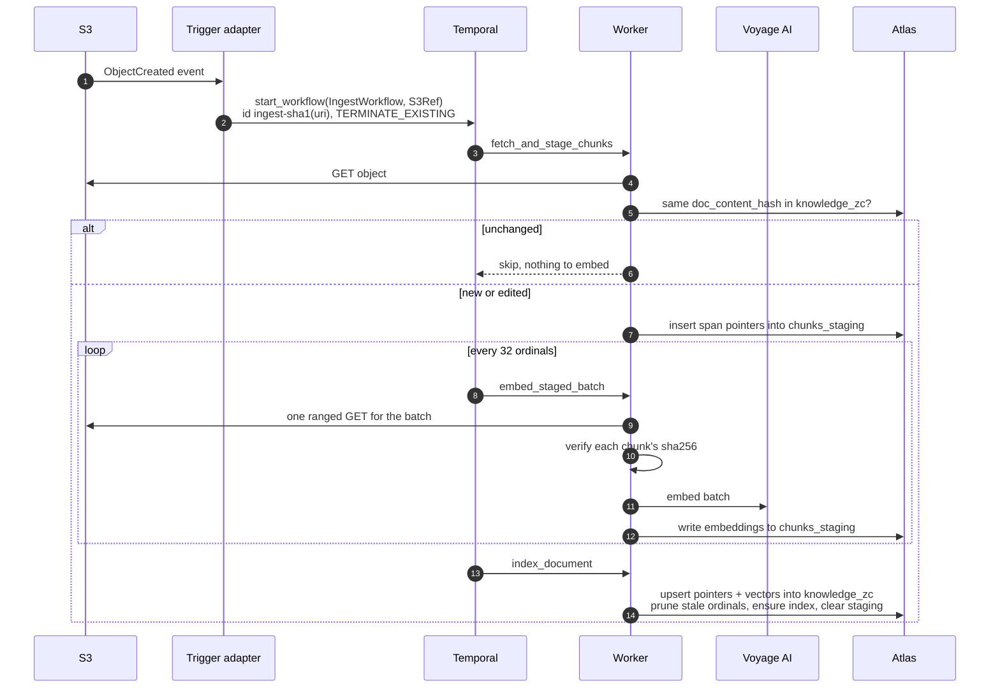
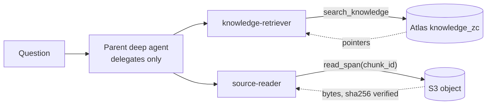

# MongoDB × Temporal: Partner Reference Architecture

A reference implementation of a durable, change-driven RAG pipeline. **Temporal** runs ingestion
into **MongoDB Atlas**, and a deep agent hosted on Atlas Agent Engine answers questions from it.
The index holds pointers and embeddings only; document text stays in the object store and is read
back, hash-verified, when the agent cites it.

> **Developers:** see [docs/RUNBOOK.md](docs/RUNBOOK.md) for prerequisites, API key setup,
> local spin-up, and cloud infra references.

---

## What is Temporal?

[Temporal](https://temporal.io) is a **durable execution platform**. It orchestrates long-running
workflows as code, with automatic retries, checkpointing, and resume-on-failure built in. You
write plain Python functions; Temporal ensures they run to completion even across crashes, deploys,
or network partitions.

In this architecture Temporal owns ingestion:

| Concern            | What Temporal guarantees                                                                                                                                                                          |
| ------------------ | ------------------------------------------------------------------------------------------------------------------------------------------------------------------------------------------------- |
| Ingestion pipeline | A crash mid-embedding resumes from the last completed batch and never re-embeds what is already done ([durable execution](https://docs.temporal.io/evaluate/major-advantages#fault-oblivious-code)) |

---

## The problem this solves

Customers hand-roll resilient ingestion/embedding pipelines and it hurts:

| Customer   | Pain hand-rolled without Temporal                                        |
| ---------- | ------------------------------------------------------------------------ |
| Customer A | MD5 change-tracking in production to decide what to re-embed             |
| Customer B | A homegrown "lambda clock" cron to generate embeddings                   |
| Customer C | A FastAPI pipeline, hand-tuning sequential vs. parallel                  |
| Customer D | A 5-hour import that fails on the last step **reruns the entire import** |

This PRA packages the pattern that removes that pain. It is already in production at multiple enterprise customers.

---

## Partner Solutions Architecture

### High-level design


Temporal is used to bring durability to the content ingestion pipeline; a separately deployed deep agent queries what it produces.

**How to read it:**

1. Changes in **data sources** (S3, RDBMS, messaging technologies, etc.) directly
   launch workflows running in Temporal.
2. **Temporal** chunks the content, calls **Voyage AI** for embeddings, and upserts a pointer
   plus its embedding into **Atlas Vector Search**. The chunk text is never stored.
3. A **hosted deep agent**, deployed separately on **MongoDB Atlas Agent Engine**, answers
   questions over the fresh knowledge: one sub-agent searches for pointers, another resolves a
   pointer back to the source object to read the text behind it.



> **Design note:** the direct trigger (S3 to the ingest workflow) relies on Temporal's durable
> execution for the "don't lose the event once the workflow starts" guarantee. If you already
> have change data capture wired through Kafka, see the
> [`with-kafka`](https://github.com/mongodb-partners/mdb-temporal-pra/tree/with-kafka) branch.

### Division of responsibility

| Concern                                                       | Owner                     |
| ------------------------------------------------------------- | ------------------------- |
| Orchestration, retries, checkpointing, backfill, resumability | **Temporal**              |
| Vector index, pointers, agent memory & state                  | **MongoDB Atlas**         |
| Embeddings                                                    | **MongoDB Voyage AI**     |
| Agent reasoning & answers                                     | **Atlas Agent Engine**    |

---

## Atlas data model

```text
Database: temporal
├── chunks_staging       ← intermediate chunks (spans, not text) during IngestWorkflow
├── knowledge_zc         ← embeddings + source pointers, Atlas Vector Search index (active), no text
├── knowledge_v2         ← blue/green target for BackfillWorkflow (deferred)
├── temporal_config      ← active collection/index pointer (flipped by cutover)
└── agent_memory         ← reserved for agent memory (not yet written)
```

Retrieval and (future) agent memory live in the **same database**: no second copy, and no sync
lag between what the pipeline writes and what the agent reads. Document text never lands here; it
is resolved from the source object at query time. See [docs/LLD.md](docs/LLD.md) sections 3 and 8
for the pointer contract and the collection schemas.

---

## Ingestion

Ingestion turns objects landing in storage into embedded, searchable knowledge, durably and
**without a message broker**. An S3 **ObjectCreated** event starts a Temporal `IngestWorkflow`
directly: an AWS Lambda in production, through the shared `handle_s3_event`. Locally,
`make seed` uploads the object and starts the same workflow itself. The moment `start_workflow` returns, the change is safe: Temporal runs the
workflow to completion across retries, worker restarts, and infra maintenance.

- **Trigger goes directly to Temporal.** Temporal's durable execution provides the "don't lose the
  event" guarantee; the trigger is a thin adapter (`pipeline/lambda_handler.py`).
- **Idempotent, update-in-place.** A content-hash check skips re-embedding unchanged objects; an
  edited object re-embeds and upserts in place (see the two-hashes note below).
- **Batched & scale-out.** Chunks embed in batches of 32, one ranged read and one Voyage call per
  batch; documents ingest concurrently, and more worker processes on the same task queue scale
  it horizontally.
- **Output.** Each chunk's embedding and a pointer back into the source object land in
  `knowledge_zc` with an Atlas Vector Search index, never the chunk text. Internals:
  [docs/LLD.md](docs/LLD.md) sections 5 and 6.

### Ingestion sequence diagram

The flow at the level of the activities in `pipeline/activities/ingest.py`:



A document that yields zero chunks (empty, unsupported or not valid UTF-8) goes to
`clear_document` instead, so it stops being citable.

---

## The query plane

This is a two-plane architecture. Ingestion runs on Temporal, as described above. The query
agent is a separate deployment: a deep agent on **MongoDB Atlas Agent Engine**
(`mongodb_agent_engine/`), with two sub-agents split by capability:

- **`knowledge-retriever`** searches the vector index and returns pointers (chunk id, source URI,
  span, score), never text.
- **`source-reader`** is the only sub-agent given the tool that resolves a pointer against the
  source object and returns the text behind it, hash-verified at read time.



Both tools run in the Agent Engine Tool Pod, which alone holds the database, Voyage, model and
AWS credentials. Egress is deny-all apart from four named hosts in `agent.yaml`. Document text
lives only in the object store; the searchable collection never stores it. See
[docs/LLD.md](docs/LLD.md) section 11 for the deployed topology and what is and is not
enforced, and [mongodb_agent_engine/README.md](mongodb_agent_engine/README.md) for the SDK and
deployment details.

---

## Quickstart (local demo)

**Prerequisites:** `uv`, the Temporal CLI, an S3 bucket the agent's egress allow-list names
(`temporal-agentic` in `us-east-1` as shipped), and, for the Playground, Docker and the
`agentengine` CLI. See [docs/RUNBOOK.md → Prerequisites](docs/RUNBOOK.md#prerequisites) for install commands.

```bash
# 1. Clone and enter the repo
git clone https://github.com/mongodb-partners/mdb-temporal-pra.git
cd mdb-temporal-pra

# 2. Copy and fill in credentials
cp .env.example .env
# Edit .env: set MONGODB_URI, VOYAGE_API_KEY, S3_BUCKET, the AWS keys, LLM_API_KEY

# 3. Install Python dependencies
make setup

# 4. Start Temporal, the worker and the trigger API
make start

# 5. Create the Atlas Vector Search index (one-time)
make index

# 6. Upload a sample document to S3 and start its ingest
make seed

# 7. Start the Agent Engine local stack and ask questions in the Playground
make playground

# 8. Tear everything down
make stop
```

Steps 4 to 7 are also `make demo`. Everything runs locally except the object store and Atlas:
the worker and the Playground's tools read the same bucket and collection, so a document
seeded in step 6 is citable in step 7. The same agent deploys to Atlas Agent Engine with the
`agentengine` CLI, and the hosted deployment has its own Playground; see
[docs/RUNBOOK.md section 10](docs/RUNBOOK.md#10-query-plane-hosted-deep-agent) and
[mongodb_agent_engine/README.md](mongodb_agent_engine/README.md). `make help` lists all
targets.

| Service         | URL                   | Notes                                              |
| --------------- | --------------------- | -------------------------------------------------- |
| Temporal Web UI | http://localhost:8233 | watch `IngestWorkflow` runs                        |
| Playground      | http://localhost:3000 | local Agent Engine stack (`make playground`)       |

---

## Repo layout

```text
mdb-temporal-pra/
├── README.md
├── Makefile                        ← all dev commands (make help)
├── pyproject.toml                  ← Python deps managed by uv
├── uv.toml                         ← uv resolver settings
├── .env.example                    ← copy → .env, fill credentials
├── agent.yaml                      ← Agent Engine manifest: entrypoint, secret grants, egress allow-list
├── dev.yaml                        ← local `agentengine dev up` settings only
├── .agentengineignore              ← narrows what `agentengine build` uploads
├── seed/                           ← sample Markdown documents for `make seed`
├── tests/                          ← pytest suite (docs/RUNBOOK.md section 4)
├── mongodb_agent_engine/
│   ├── app.py                      ← hosted deep agent: search + read tools, two sub-agents
│   ├── llm.py                      ← model selection (LLM_PROVIDER, LLM_MODEL)
│   └── README.md                   ← SDK surface, capability boundary, deployment notes
├── pipeline/
│   ├── worker.py                   ← Temporal worker process (ingestion only)
│   ├── trigger.py                  ← shared handle_s3_event → start IngestWorkflow
│   ├── lambda_handler.py           ← AWS Lambda entrypoint for real S3 (same handler)
│   ├── retrieval.py                ← vector search, returns pointers, never text
│   ├── spanio.py                   ← resolves a pointer against the source object, hash-verified
│   ├── workflows/
│   │   ├── ingest_workflow.py      ← IngestWorkflow: stage → embed in batches → index
│   │   └── backfill_workflow.py    ← BackfillWorkflow: re-embed → knowledge_v2 (deferred)
│   ├── activities/
│   │   ├── ingest.py               ← stage + embed + index + clear activities
│   │   └── backfill.py             ← re-embed activity (deferred, fails fast)
│   ├── extractors/                 ← Markdown extractor; pdf / csv / text are deferred stubs
│   ├── config_store.py             ← active collection/index pointer
│   └── search_index.py             ← idempotent Atlas Vector Search management
├── infra/
│   ├── create_atlas_index.py       ← `make index`
│   ├── query_atlas.py              ← `make query`
│   └── atlas_indexes.json          ← Vector Search index definitions
└── docs/
    ├── RUNBOOK.md                  ← developer setup guide
    ├── LLD.md                      ← low-level design
    ├── decisions/                  ← Architecture Decision Records
    └── images/                     ← architecture diagrams
```

---

## Developer guide

| Document                                               | Description                                                                                       |
| ------------------------------------------------------ | ------------------------------------------------------------------------------------------------- |
| **[docs/RUNBOOK.md](docs/RUNBOOK.md)**                 | Prerequisites, API key setup, local spin-up, cloud infra references                               |
| **[docs/LLD.md](docs/LLD.md)**                         | Low-level design: data contracts, workflow internals, scaling to multiple sources and data types  |
| **[mongodb_agent_engine/README.md](mongodb_agent_engine/README.md)** | The hosted deep agent: SDK surface, what the capability split enforces, deployment on Atlas Agent Engine |
| **[docs/decisions/](docs/decisions/)**                 | Architecture Decision Records, e.g. ADR 0001 (direct-from-S3 triggering)                          |

---

## License

The code is licensed under the [Apache License 2.0](LICENSE). The sample document in `seed/`
is not covered by that license and keeps its own copyright notice.
