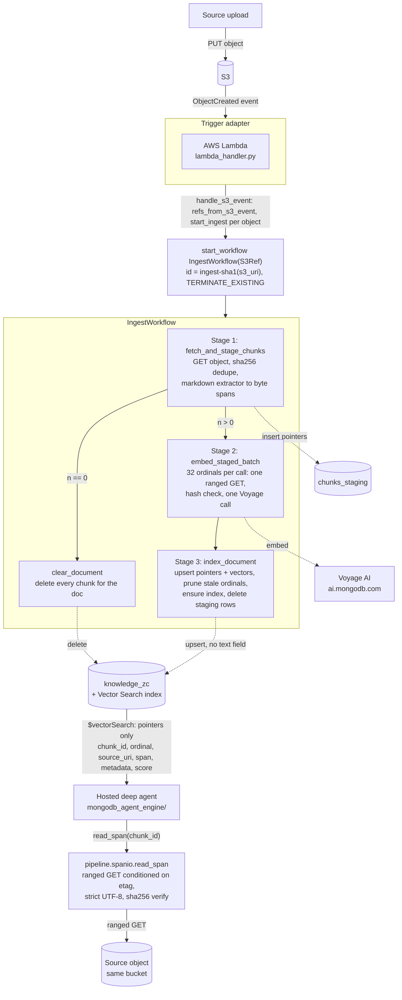
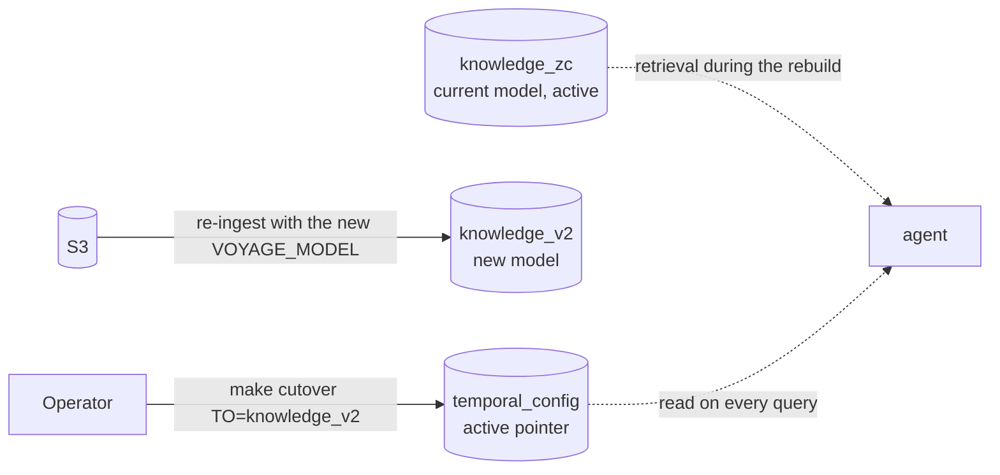
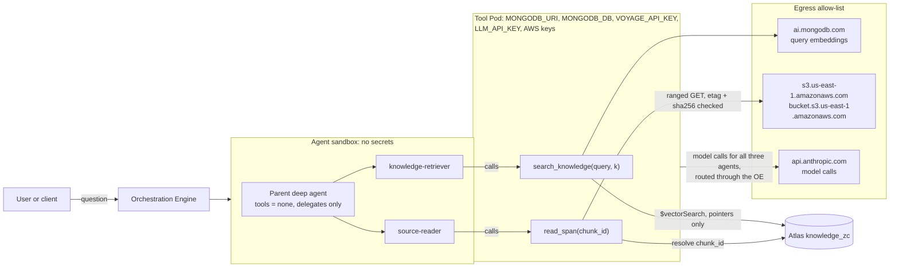

# Low-Level Design

**zero-copy-rag**
Last updated: 2026-10-11

---

## Table of contents

- [1. Overview](#1-overview)
- [2. Component inventory](#2-component-inventory)
- [3. Data contracts](#3-data-contracts)
- [4. End-to-end data flow](#4-end-to-end-data-flow)
- [5. Workflow design](#5-workflow-design)
  - [5.1 IngestWorkflow](#51-ingestworkflow)
  - [5.2 Model change: re-ingest and cutover](#52-model-change-re-ingest-and-cutover)
- [6. Activity design](#6-activity-design)
- [7. Extractor system](#7-extractor-system)
- [8. MongoDB data model](#8-mongodb-data-model)
- [9. Atlas Vector Search index](#9-atlas-vector-search-index)
- [10. Trigger layer](#10-trigger-layer)
- [11. Query plane (hosted deep agent)](#11-query-plane-hosted-deep-agent)
- [12. Configuration reference](#12-configuration-reference)
- [13. Scaling to multiple data sources](#13-scaling-to-multiple-data-sources)
- [14. Scaling to multiple data types](#14-scaling-to-multiple-data-types)
- [15. Extension patterns and future sources](#15-extension-patterns-and-future-sources)

---

## 1. Overview

This implementation is a **durable, event-driven, zero-copy RAG ingestion pipeline**, built on
two services:

| Layer               | Service       | Role                                                                              |
| -------------------- | -------------- | ---------------------------------------------------------------------------------- |
| Orchestration       | Temporal      | Ingestion (stage spans, embed, index) as three activities, durable and resumable |
| Storage + retrieval | MongoDB Atlas | Single store for staged pointers, indexed pointers, vector search                |

Embeddings are provided by **Voyage AI (MongoDB AI)**. There is no reranking step; reranking was
dropped from the design entirely.

The searchable collection (`knowledge_zc`) never stores chunk text. Every document there carries
an embedding plus a pointer into the source S3 object (bucket, key, etag, a byte span, and a
sha256 of the chunk's bytes). The only way from a search result back to text is
`pipeline.spanio.read_span(chunk_id)`, which resolves the pointer server-side, does a ranged S3
GET conditioned on the etag, decodes strictly as UTF-8, and verifies the hash before returning
anything. See section 11 for how that function is exposed to a query-side agent.

Ingestion is triggered **directly** from an object-created event, no Kafka or message broker.
The moment the object lands, an AWS Lambda subscribed to the bucket starts an `IngestWorkflow`
(locally, `make seed` starts it right after the upload); once started, Temporal guarantees it
runs to completion through failures. The decisions behind this split are recorded in
`docs/decisions/` (ADR 0001, pointers instead of text; ADR 0002, ingestion on Temporal and the
agent on Agent Engine).

The design is **source-agnostic** at two seams: the `S3Ref` data contract plus the
`handle_s3_event` trigger core (adding a source means calling `start_ingest` from a new adapter),
and the extractor factory (adding a file type means one new extractor class, subject to the
byte-reproducibility constraint described in section 7). Workflows, activities, and the Atlas
storage layer are unchanged in both cases.

---

## 2. Component inventory

```
pipeline/
├── worker.py               <- Temporal worker (hosts ingestion workflows/activities)
├── config.py               <- Pydantic settings (env-driven, lru_cache singleton)
├── models.py               <- S3Ref, Span, doc_id_for_uri, sha256_hex
├── clients.py               <- lazy clients: Mongo, Voyage, S3, SQS, cached per credential
├── trigger.py                <- shared trigger core: handle_s3_event + start_ingest
├── lambda_handler.py           <- AWS Lambda entrypoint for real S3 (same handle_s3_event core)
├── s3util.py                    <- parse an S3 ObjectCreated event (direct, SQS or SNS) into list[S3Ref]
├── search_index.py                <- idempotent Atlas Vector Search index management
├── config_store.py                 <- active collection/index/model pointer (cutover)
├── retrieval.py                     <- $vectorSearch over the active collection; returns pointers, never text
├── spanio.py                         <- the only module that resolves a pointer back into text
├── cutover.py                         <- flip the active collection/index/model pointer
├── seed.py                              <- dev utility: upload a file and start its ingest
├── workflows/
│   └── ingest_workflow.py                <- IngestWorkflow: stage -> embed in batches -> index
├── activities/
│   └── ingest.py                            <- fetch_and_stage_chunks, embed_staged_batch,
│                                                index_document, clear_document
└── extractors/
    ├── base.py                                 <- Extractor ABC, char-to-byte-span conversion,
    │                                               window() splitter
    ├── factory.py                                <- get_extractor(): markdown only today
    └── markdown.py                                <- the only supported extractor

mongodb_agent_engine/
├── app.py                <- Agent Engine entrypoint: registers search_knowledge + read_span as tools,
│                             wires two sub-agents (knowledge-retriever, source-reader)
├── llm.py                <- model selection from LLM_PROVIDER / LLM_MODEL, optional gateway via LLM_BASE_URL
└── README.md              <- SDK surface, capability boundary, deployment notes

agent.yaml                  <- Agent Engine manifest: entrypoint, sandbox secret grants, egress allow-list
dev.yaml                    <- local `agentengine dev up` settings only
.agentengineignore          <- narrows the source archive `agentengine build` uploads
```

The old OpenAI Agents SDK agent (an `agent/` directory: `DeepResearchAgent`, `vector_search_tool`,
`rerank_tool`, and its React UI) has been deleted. `mongodb_agent_engine/` is its
replacement query plane, described in section 11.

---

## 3. Data contracts

Defined in `pipeline/models.py`. All contracts are plain Python `@dataclass`es so they serialize
cleanly through Temporal's default JSON data converter.

### S3Ref

The atomic unit passed into `IngestWorkflow`. Identifies a single object in S3.

```python
@dataclass
class S3Ref:
    bucket: str          # S3 bucket name
    key: str             # object key (path within bucket)
    s3_uri: str          # "s3://{bucket}/{key}", canonical identifier
    etag: str = ""       # object ETag, conditions every later ranged read
    size: int = 0
    content_type: str = ""
```

`S3Ref.make(bucket, key, ...)` derives `s3_uri` and strips quotes from the ETag.

### Span

```python
@dataclass
class Span:
    """A byte range in the unmodified source object. End is exclusive."""
    start: int
    end: int
    kind: str = "byte"
```

Spans are produced by the extractor base class (`pipeline/extractors/base.py`) via a
character-to-byte prefix array built once per document, so `body[span.start:span.end].decode()`
is guaranteed to equal the chunk text the extractor saw at staging time.

### Document identity and deduplication

```python
def doc_id_for_uri(uri: str) -> str:
    # SHA-1 of the URI -> 16-char hex. Stable across re-uploads of the same key.
    return hashlib.sha1(uri.encode()).hexdigest()[:16]

def sha256_hex(data: bytes | str) -> str:
    # Used for content-hash dedupe and per-chunk hash verification.
    return hashlib.sha256(data).hexdigest()
```

`fetch_and_stage_chunks` short-circuits if `knowledge_zc` already contains a doc with the same
`doc_id` and `doc_content_hash`: identical bytes at the same key are never re-embedded.

### Dead contracts still in `models.py`

`Chunk`, `ChunkResult`, and `EmbeddedChunk` are dataclasses left over from before the
conversion to pointer-only storage. Nothing in the current codebase imports them; the actual
staged and indexed records are plain dicts built directly in `pipeline/activities/ingest.py` (see
section 8). They are noted here rather than deleted from this document because they are real,
present code, not because they describe the live data path.

---

## 4. End-to-end data flow



Only a `read_span` result with status `ok` carries text. `stale`, `missing` and `unknown` carry
none.

No `sources` collection and no broker sit between the event and the workflow: the trigger adapter
calls `start_ingest` directly, and durability begins the instant `start_workflow` returns.

---

## 5. Workflow design

### 5.1 IngestWorkflow

**File:** `pipeline/workflows/ingest_workflow.py`

**Input:** `S3Ref`, optional `target_collection`

**Stages:**

| # | Activity                                | Timeout | Retries                              | Idempotent                                                       |
| - | ---------------------------------------- | ------- | -------------------------------------- | -------------------------------------------------------------------- |
| 1 | `fetch_and_stage_chunks`                | 5 min   | 5 attempts                            | Yes, short-circuits on a matching `doc_content_hash`             |
| 2 | `embed_staged_batch` (per batch of 32)  | 5 min   | 20 attempts (exp backoff, max 30s)    | Yes, skips a batch already embedded with the active model        |
| 3 | `index_document`                        | 2 min   | 6 attempts                            | Yes, upserts by `chunk_id`; a retry after staging was consumed returns the indexed count |
| - | `clear_document` (only when n == 0)     | 2 min   | 6 attempts                            | Yes, deletes every chunk for the doc                             |

**Batched embedding, not fan-out.** Stage 2 embeds `_EMBED_BATCH` (32) chunks per activity call,
one contiguous byte range re-read and one Voyage call per batch:

```python
for start in range(0, n, _EMBED_BATCH):
    await workflow.execute_activity(
        embed_staged_batch,
        args=[doc_id, list(range(start, min(start + _EMBED_BATCH, n))), None],
        start_to_close_timeout=timedelta(minutes=5),
        heartbeat_timeout=timedelta(seconds=60),
        retry_policy=_EMBED_RETRY,
    )
```

Batches within one workflow run are awaited **sequentially**, not fanned out with
`asyncio.gather`. Batching exists to turn many small ranged reads into one ranged read per batch
(a 1200/150 chunking of a moderate markdown file is on the order of hundreds of chunks; one GET
per chunk would be hundreds of requests), not to add intra-document concurrency. Multiple
documents still ingest concurrently, because each is an independent `IngestWorkflow` execution
competing for the worker's 16 activity slots (`ThreadPoolExecutor(max_workers=16)` with a
matching `max_concurrent_activities=16`, so the worker never accepts a task it has no thread for).

**Resumability guarantee:** each batch is a separate activity, and `embed_staged_batch` skips a
chunk already embedded with the active model. If the worker crashes mid-run, Temporal resumes and
re-runs only the unfinished batches, never re-embedding completed work. The embed activity's
retry policy allows 20 attempts with exponential backoff, so a transient Voyage error or rate
limit is retried across about eight minutes of backoff rather than failing the workflow on the first blip. The
cap is deliberate: an unlimited policy retries a permanent failure (a revoked API key, a deleted
bucket) forever, holding the workflow open with no operator signal and no terminal state.

**Update-in-place:** re-uploading the same key with new content yields a new `doc_content_hash`.
Stage 1 clears stale staging rows, Stage 2 re-embeds, and Stage 3 upserts into `knowledge_zc` and
prunes every chunk of that `doc_id` whose ordinal is not among the ordinals just written
(leftovers from a previously longer version). The prune is keyed on the written ordinal set
rather than on a count, because a count is only a valid bound while the embedded ordinals are
exactly 0..n-1. A gap in that set would make the prune delete chunks the same activity had just
upserted.

**Lifecycle transitions clear the document.** If Stage 1 yields zero chunks (empty content, an
unsupported source type, or bytes that fail to decode as UTF-8), the workflow does not fall
through to indexing: it calls `clear_document(doc_id, reason, target_collection)`, which deletes
every existing chunk for that `doc_id`. A document that stops producing chunks stops being
citable; leaving its old chunks searchable would mean the agent could cite text that is gone.

**Workflow ID / dedupe:** the id is `ingest-<sha1(s3_uri)>` (stable per object key) with
`WorkflowIDConflictPolicy.TERMINATE_EXISTING`; a re-upload while an ingest is still running
terminates the in-flight run and starts fresh, so there is never a duplicate or a race.

### 5.2 Model change: re-ingest and cutover

There is no backfill. Re-embedding needs chunk text and `knowledge_zc` stores none, so a model
change re-ingests from S3, which holds the only copy, into a second collection and then flips the
active pointer.

`IngestWorkflow` writes to `KNOWLEDGE_COLLECTION` unless a `target_collection` is passed, and
`temporal_config.active` names the collection, index, model and dimension that retrieval and
`read_span` use. `make cutover TO=<collection>` rewrites that document, reading the model and
dimension from a document in the target, and refuses an empty target. The old collection stays
in place for rollback. Steps are in `docs/RUNBOOK.md` section 8.



---

## 6. Activity design

All activities follow three rules:

1. **Idempotent**: safe to retry; re-running a completed activity produces no duplicate writes.
2. **Heartbeating**: `embed_staged_batch` heartbeats three times, once after each step that can
   outlast the 60s `heartbeat_timeout`: after the ranged GET returns, after every span in the
   batch verifies against its hash, and after the embedding call returns. Each fires after its
   slow step rather than before it, because a heartbeat sent ahead of a call reports progress
   that has not happened yet, which is the stall the timeout exists to catch.
3. **Sync execution**: activities use standard `pymongo`, `voyageai`, and `boto3` clients and run
   in the worker's `ThreadPoolExecutor(max_workers=16)`, keeping the Temporal event loop free.

### Activity retry policy (embed batches)

```python
_EMBED_RETRY = RetryPolicy(
    initial_interval=timedelta(seconds=2),
    backoff_coefficient=2.0,
    maximum_interval=timedelta(seconds=30),
    maximum_attempts=20,
    non_retryable_error_types=["SpanStale", "SpanMissing", "RuntimeError", "ValueError"],
)
```

Voyage AI rate-limit (429) responses and transient network errors are retried with exponential
backoff up to a 30-second cap, for at most 20 attempts. The listed types are not retried at all.
A span that fails hash verification, an embedding response shorter than its input batch, and a
misuse of `index_document` are all deterministic: retrying repeats them 20 times and buries the
real error behind a timeout.

### The four ingest activities

- `fetch_and_stage_chunks`: downloads the object, checks the doc-hash short-circuit, runs the
  extractor, and stages pointer-only documents in `chunks_staging`. Never writes chunk text.
- `embed_staged_batch`: re-reads exactly the byte range covering one batch, decodes it, verifies
  each chunk's sha256 against its staged `content_hash`, and embeds the whole batch in one Voyage
  call. Raises rather than silently indexing a chunk whose bytes no longer match what was staged.
- `index_document`: upserts embedded pointers into the searchable collection, prunes any ordinal
  not among those just written (leftovers from a previous longer version), and ensures the vector
  index. With zero staged chunks it distinguishes two cases by asking the searchable collection
  whether THIS `doc_content_hash` is already indexed. If it is, the call is an at-least-once retry
  arriving after the writes landed, and it returns `already_indexed`. If it is not, it raises
  `ValueError`, because clearing a document is `clear_document`'s job and taking that effect here
  would prune without recording a reason.
- `clear_document`: deletes every chunk for a `doc_id` from both the searchable collection and
  staging, for the empty / unsupported / undecodable lifecycle transition.

---

## 7. Extractor system

**File:** `pipeline/extractors/`

The extractor factory decouples file-type handling from the workflow, but every extractor must
satisfy a stronger constraint than "produce some chunks": the base class enforces that
`body[span.start:span.end].decode("utf-8")` equals exactly the chunk text the extractor produced,
because that byte span is the only thing ever stored. An extractor that transforms or renders
text (PDF text extraction, CSV rows rendered as `key: value` records) cannot satisfy this and is
deferred rather than wired in with a lossy approximation.

### Base class

```python
class Extractor(ABC):
    name: str
    chunk_size: int
    chunk_overlap: int

    @abstractmethod
    def ranges(self, text: str, c2b: Sequence[int]) -> list[tuple[int, int, dict]]:
        """Return ordered (char_start, char_end, meta) triples over text."""

    def chunk(self, body: bytes) -> list[RawChunk]:
        """Decode body as UTF-8, build the char->byte map, call ranges(),
        convert every (char_start, char_end) into a byte Span."""
```

Decoding failure (`UnicodeDecodeError`) or a byte map that does not cover the whole object raises
`UnsupportedSource` before any extractor-specific logic runs.

### Chunking strategy

The base provides `window_indices()`, a character-window splitter with overlap, trimmed inward
past whitespace at both edges. Default `chunk_size=1200`, `chunk_overlap=150` (configurable via
`.env`).

### Registered extractors

| Extension / MIME                     | Extractor          | Status                                                                    |
| -------------------------------------- | -------------------- | ---------------------------------------------------------------------------- |
| `.md`, `.markdown` / `text/markdown`, `text/x-markdown` | `MarkdownExtractor` | Supported. Splits on `#`/`##`/.../`######` headings, then character-windows each section; the heading itself is carried as a byte span (`heading_span`), never as text. |
| anything else                         | none                | `UnsupportedSource`; the workflow clears the document. PDF and CSV are refused on purpose: extracted PDF text and rendered CSV records never appear verbatim in the file, so no byte range can reproduce them. |

Resolution order: **file extension, then MIME type, then `UnsupportedSource`** if neither
matches a registered markdown key. `factory.py` registers only the markdown extractor, so any
non-markdown key falls straight to the "unsupported source type" error.

---

## 8. MongoDB data model

Database: `temporal` (configurable via `MONGODB_DB`)

### `chunks_staging` collection

Transient. Created by `fetch_and_stage_chunks`, updated by `embed_staged_batch`, deleted by
`index_document` (or `clear_document`, on the empty/unsupported/undecodable path). Survives
worker crashes, the workflow resumes from the correct batch.

```json
{
  "doc_id": "a3f9c1d2e4b5f678",
  "chunk_id": "a3f9c1d2e4b5f678:0",
  "ordinal": 0,
  "span": { "kind": "byte", "start": 0, "end": 842 },
  "content_hash": "sha256hex",
  "doc_content_hash": "sha256hex",
  "source_uri": "s3://temporal-agentic/docs/my-doc.md",
  "bucket": "temporal-agentic",
  "key": "docs/my-doc.md",
  "etag": "\"...\"",
  "metadata": { "extractor": "markdown", "section": 0 },
  "extractor": "markdown",
  "status": "pending | embedded",
  "embedding": null
}
```

There is no `text` field anywhere in this document. Indexes: `{ chunk_id: 1 }` (unique),
`{ doc_id: 1, status: 1, ordinal: 1 }` (created by `infra/create_atlas_index.py`).

### `knowledge_zc` collection (active, blue)

The searchable store. Upserted by `index_document` using `chunk_id` as the upsert key. The name
itself signals the invariant: **z**ero-**c**opy.

```json
{
  "doc_id": "a3f9c1d2e4b5f678",
  "chunk_id": "a3f9c1d2e4b5f678:0",
  "ordinal": 0,
  "span": { "kind": "byte", "start": 0, "end": 842 },
  "content_hash": "sha256hex",
  "doc_content_hash": "sha256hex",
  "embedding": [0.123, ...],
  "model": "voyage-3.5",
  "dim": 1024,
  "source_uri": "s3://temporal-agentic/docs/my-doc.md",
  "bucket": "temporal-agentic",
  "key": "docs/my-doc.md",
  "etag": "\"...\"",
  "metadata": { "extractor": "markdown", "section": 0 }
}
```

### `knowledge_v2` collection (second collection for a model change)

Same schema as `knowledge_zc`. Filled by re-ingesting from S3 with the new model (section 5.2),
and active after `make cutover TO=knowledge_v2`.

### `temporal_config` collection

Single document: the active collection/index/model pointer. Read by `retrieval.py` and
`spanio.py` on every call.

```json
{
  "_id": "active",
  "active_collection": "knowledge_zc",
  "active_index": "temporalai_search_index",
  "model": "voyage-3.5",
  "dim": 1024
}
```

---

## 9. Atlas Vector Search index

**File:** `pipeline/search_index.py`

Created idempotently by `ensure_vector_index` at the end of every `index_document`:

```json
{
  "fields": [
    { "type": "vector", "path": "embedding", "numDimensions": 1024, "similarity": "cosine" },
    { "type": "filter", "path": "doc_id" },
    { "type": "filter", "path": "source_uri" }
  ]
}
```

The `filter` fields let retrieval scope to a document or source URI without a full scan.
`ensure_vector_index` lists existing indexes and skips creation if present.

---

## 10. Trigger layer

The trigger turns an S3 **ObjectCreated** event into the start of an `IngestWorkflow`. All
adapters funnel through one shared, source-agnostic core in `pipeline/trigger.py`:

```python
async def handle_s3_event(client, event) -> list[str]:
    # parse the event envelope -> S3Ref[]; start one IngestWorkflow per object
    return [await start_ingest(client, ref) for ref in refs_from_s3_event(event)]

async def start_ingest(client, ref: S3Ref) -> str:
    handle = await client.start_workflow(
        "IngestWorkflow", ref,
        id=f"ingest-{doc_id_for_uri(ref.s3_uri)}",
        task_queue=settings.temporal_task_queue,
        id_conflict_policy=WorkflowIDConflictPolicy.TERMINATE_EXISTING,
    )
    return handle.id
```

`refs_from_s3_event` (`s3util.py`) parses the standard `Records[*].s3` envelope (SQS- and SNS-wrapped
bodies are unwrapped, and `s3:TestEvent` yields no refs), URL-decoding the key.

### Local dev: `seed.py`

Nothing emits object-created events locally, so `seed.py` starts the workflow itself: it uploads
the file, then calls `start_ingests(refs)` (`trigger.py`), a synchronous
wrapper over `start_ingest`. The ref carries the ETag and size from the upload. `--no-trigger`
(`NO_TRIGGER=1` through `make`) skips the start, for a bucket whose event notification will start
it instead; if both fire, the two starts share one workflow id and the later replaces the earlier.

### Production: AWS Lambda to `lambda_handler.py`

In production, an AWS Lambda subscribed to the bucket's S3 event notifications runs the **same**
core:

```python
def lambda_handler(event, context) -> dict:
    return {"started": asyncio.run(_run(event))}   # _run connects a client, calls handle_s3_event
```

Same parsing, same `start_ingest`, same durability guarantee. Deploy notes are in `docs/RUNBOOK.md` section 9.

---

## 11. Query plane (hosted deep agent)

The old OpenAI Agents SDK agent (`agent/`: `DeepResearchAgent`, `vector_search_tool`,
`rerank_tool`, and a bundled React UI) is gone. It is replaced by `mongodb_agent_engine/`, a deep
agent deployed on MongoDB Atlas Agent Engine. This is a separate deployment from the local
ingestion stack: nothing in `Makefile` starts it. It is built and deployed with the
`agentengine` CLI from the repository root, which is the agent workspace (`agent.yaml`).



The Atlas cluster is reached over the MongoDB wire protocol, which the platform admits through
the cluster's IP access list rather than through the HTTPS egress allow-list above.

### Tools and sub-agents

`mongodb_agent_engine/app.py` registers two tools directly on top of `pipeline/` code, both with
`is_local=False` so they run in the Tool Pod rather than in the agent runtime:

- `search_knowledge(query, k=8)` wraps `pipeline.retrieval.vector_search`. It can never return
  document text: the underlying `$vectorSearch` projection has no `text` key by construction.
- `read_span(chunk_id)` wraps `pipeline.spanio.read_span`, called positionally with only the
  `chunk_id`. Its result carries text only when `status == "ok"`; `unknown`, `missing`, and
  `stale` all carry none.

These are split across two sub-agents: `knowledge-retriever` (tools=[`search_knowledge`]) and
`source-reader` (tools=[`read_span`]). The parent agent is built with `tools=[]`, so it has to
delegate. Its instructions tell it to delegate search to `knowledge-retriever`, pick two to four
promising `chunk_id`s, delegate those to `source-reader`, and quote only text that came back with
`status == "ok"`.

The model is chosen in `mongodb_agent_engine/llm.py` from `LLM_PROVIDER` (default
`anthropic`, model `claude-sonnet-5`) with an optional `LLM_MODEL` override, and optionally
routed through a compatible gateway with `LLM_BASE_URL` and `LLM_API_KEY_HEADER`. The raw
model is passed to `app.deep_agent`, which wraps it in the SDK's `SecureWrappedLLM`. That wrapper
routes every model call through the Orchestration Engine to the Tool Pod, which is why
`LLM_API_KEY` is granted to the tool sandbox and the agent sandbox holds no secret at all.

### What is and is not enforced

`read_span`'s signature is a real, Python-level guarantee: no caller, model or otherwise, can
pass a bucket, key, byte range, or content hash through this tool. `tests/test_agent_wiring.py`
pins that signature and the `is_local=False` placement.

The platform enforces two things server-side: secrets are granted per sandbox (the agent sandbox
gets none, the Tool Pod gets the list in `agent.yaml`), and egress is deny-all apart from the
four named FQDNs. `tests/test_egress.py` holds the code's configured endpoints to that list.

The sub-agent split is **not** enforced. Nothing in the SDK or `deepagents` treats a sub-agent's
`tools=[...]` list as a hard dispatch restriction, and both tools share one Tool Pod, one
process and one set of credentials. `pipeline/clients.py` builds its clients lazily and caches
them per resolved credential, so there is no per-sub-agent credential scoping. A subverted
`knowledge-retriever` is held back by the fact that retrieval cannot return text, not by the
fact that it was not given the reader. See `mongodb_agent_engine/README.md` for the full
statement.

### SDK surface

`app.py` imports `from agent_engine_sdk_langgraph import App` and `from deepagents import
SubAgent`. The SDK is supplied by the platform's base images rather than by an index: the
hosted builder and the local dev image both install it from baked wheels, and the PyPI names are
placeholders that `make install` skips (`uv sync --no-install-package`).
`mongodb_agent_engine/README.md` covers the SDK details that are easy to get wrong.

### Retrieval query (`pipeline/retrieval.py`)

```python
pipeline = [
    { "$vectorSearch": {
        "index": active["active_index"], "path": "embedding", "queryVector": list(qv),
        "numCandidates": max(100, k * 20), "limit": k,
    }},
    { "$project": { "_id": 0, "source_uri": 1, "chunk_id": 1, "ordinal": 1,
                    "span": 1, "metadata": 1,
                    "score": { "$meta": "vectorSearchScore" } } },
]
```

The query is embedded with the **active** model from `temporal_config` (so it matches the
collection's vector space after a cutover). The projection has no `text` key; there is nothing to
remove, because nothing was ever put there.

---

## 12. Configuration reference

All settings live in `.env` (loaded by `pipeline/config.py` via Pydantic Settings).

| Variable                  | Default                 | Description                                       |
| --------------------------- | -------------------------- | ---------------------------------------------------- |
| `MONGODB_URI`             | (none)                  | Atlas connection string (required)                |
| `MONGODB_DB`              | `temporal`               | Database name                                     |
| `CHUNKS_COLLECTION`       | `chunks_staging`         | Transient staging between workflow stages         |
| `KNOWLEDGE_COLLECTION`    | `knowledge_zc`           | Active (blue) searchable pointer + vector store    |
| `KNOWLEDGE_V2_COLLECTION` | `knowledge_v2`           | Second collection for a model change              |
| `CONFIG_COLLECTION`       | `temporal_config`         | Active pointer document                           |
| `VOYAGE_API_KEY`          | (none)                   | Voyage AI key (embeddings)                        |
| `VOYAGE_MODEL`            | `voyage-3.5`              | Embedding model (1024-dim)                        |
| `VOYAGE_BASE_URL`         | `https://ai.mongodb.com/v1` | Voyage endpoint, passed explicitly (see `pipeline/clients.py`) |
| `EMBED_DIM`               | `1024`                    | Embedding dimensionality (must match model)       |
| `CHUNK_SIZE`              | `1200`                    | Maximum characters per chunk                      |
| `CHUNK_OVERLAP`           | `150`                     | Overlap characters between adjacent chunks        |
| `TEMPORAL_ADDRESS`        | `localhost:7233`          | Temporal server address                           |
| `TEMPORAL_NAMESPACE`      | `default`                 | Temporal namespace                                |
| `TEMPORAL_TASK_QUEUE`     | `temporal-pipeline`        | Worker task queue                                 |
| `AWS_REGION`              | `us-east-1`               | AWS region for the S3 client                      |
| `AWS_ACCESS_KEY_ID`       | (none)                    | Explicit creds (blank falls back to boto3's chain) |
| `AWS_SECRET_ACCESS_KEY`   | (none)                    | Explicit creds (blank falls back to boto3's chain) |
| `S3_BUCKET`               | (none)                    | Source bucket                                     |

The hosted agent reads five more variables from its environment, not from `pipeline/config.py`
(`mongodb_agent_engine/llm.py`):

| Variable       | Default            | Description                                                                 |
| -------------- | ------------------ | --------------------------------------------------------------------------- |
| `LLM_PROVIDER` | `anthropic`        | `anthropic`, `openai` or `gemini`                                           |
| `LLM_MODEL`    | per provider       | Overrides the provider's default model (`claude-sonnet-5` for `anthropic`)  |
| `LLM_API_KEY`  | (none)             | Key for the selected provider or gateway                                    |
| `LLM_BASE_URL` | (none)             | Anthropic- or OpenAI-compatible gateway URL; blank calls the provider       |
| `LLM_API_KEY_HEADER` | (none)       | Extra header that carries `LLM_API_KEY`, for gateways that need one         |

Settings removed with the old agent: `openai_api_key`, `agent_model`, `agent_max_turns`,
`agent_api_port`, `voyage_rerank_model`. `trigger_api_port` went with the HTTP trigger, which had no
remaining caller.

---

## 13. Scaling to multiple data sources

The design is **source-agnostic at the trigger seam**: any adapter that can build an `S3Ref` (or
object pointer) and call `start_ingest` feeds the pipeline, no broker required. The workflow,
activities, and storage layer are unchanged per source; only the trigger adapter differs.

### Current source: S3

```
S3 upload -> ObjectCreated event -> AWS Lambda -> handle_s3_event -> start_ingest(S3Ref) -> IngestWorkflow
make seed -> upload -> start_ingests([S3Ref])                        -> IngestWorkflow   (local)
```

### Adding a new source: general pattern

```
Step 1:  A source event fires (object store, queue, CDC, webhook).
Step 2:  A thin adapter (Lambda / small consumer / HTTP handler) turns it into an S3Ref
         (or, for inline content, uploads to S3 first) and calls start_ingest / handle_s3_event.
```

There is no `sources` collection, no sink connector, and no change-stream watcher to operate.

### Source examples

- **Other object stores / SQS-driven S3:** `refs_from_s3_event` already unwraps SQS and SNS
  bodies, so a queue consumer only has to hand each message to `handle_s3_event`. No consumer
  ships in this repo.
- **RDBMS / CDC (Debezium, etc.):** a small consumer receives change events and calls
  `start_ingest`. For inline row content, extend the contract with a payload and branch in
  `fetch_and_stage_chunks`, keeping in mind the byte-reproducibility constraint from section 7.
- **Existing Atlas data (change stream):** an Atlas trigger or a watcher process calls
  `start_ingest` per change.
- **Webhook / HTTP (Notion, GitHub, etc.):** a small authenticated HTTP handler (none ships here)
  uploads the payload to S3, constructs an `S3Ref` and calls `start_ingest`.

### Multi-source worker scaling

The Temporal worker is stateless. Scale horizontally by running more worker processes on the same
task queue; Temporal distributes workflow and activity tasks across them automatically.
Per-worker concurrency is `ThreadPoolExecutor(max_workers=16)`, tune to the embedding API rate
limit.

```bash
uv run python -m pipeline.worker &   # worker 1
uv run python -m pipeline.worker &   # worker N
```

---

## 14. Scaling to multiple data types

The extractor factory (`pipeline/extractors/factory.py`) is the intended extension point for new
file or data types. Workflows and activities are type-agnostic: they receive `bytes` and call
`get_extractor(key, content_type).chunk(body)`. Markdown is the only format wired in today;
everything else is refused (section 7).

### Adding a new extractor

1. Create `pipeline/extractors/my_format.py` subclassing `Extractor`, implementing `ranges()`.
2. The chunk text your `ranges()` implies must be byte-for-byte reconstructible from the source
   object at the returned character range; if the format requires transforming or rendering the
   source (as PDF and CSV do here), it cannot be added this way without also changing what gets
   stored.
3. Register it in `factory.py` (`_BY_EXT["myext"] = MyFormatExtractor`, and/or `_BY_MIME[...]`).
4. No changes to workflows, activities, or the Atlas data model are needed beyond that.

### Current extractors

| Extractor           | Status    | `ranges()` behavior                                          |
| --------------------- | ----------- | ---------------------------------------------------------------- |
| `MarkdownExtractor` | Supported | Splits on `#`/`##`/`###` headings; window-splits long sections |

### Chunking parameter tuning (once/if a format is un-deferred)

| Use case                             | `CHUNK_SIZE` | `CHUNK_OVERLAP`                 |
| -------------------------------------- | -------------- | ---------------------------------- |
| Long narrative docs (markdown)       | 1200         | 150                             |
| Short structured records (CSV, JSON) | 512          | 64                              |
| Code files                           | 800          | 200 (preserve function context) |
| IoT telemetry batches                | 400          | 0 (batches are atomic)          |

---

## 15. Extension patterns and future sources

### Multi-tenant / multi-database

Parameterize `IngestWorkflow(ref, target_collection="customer_a_knowledge")`; the argument
threads through `index_document` and `clear_document`. Point the active pointer
(`config_store.set_active`) at the tenant collection.

### Parallel ingestion

Fan out multiple `IngestWorkflow` starts (each is independent, operating on disjoint `doc_id`s):

```python
await asyncio.gather(*[start_ingest(client, ref) for ref in refs])
```

### Incremental sync (change-driven dedupe)

The content-hash check in `fetch_and_stage_chunks` gives built-in incremental sync:

- Same key, same content: `status: "unchanged"`, returns immediately, no embedding call.
- Same key, new content: re-embed; `index_document` updates in place and prunes stale chunks.
- New key: full ingest.

### Scheduled reconciliation / full re-sync

Because the object store (S3) is the source of truth, a **Temporal Scheduled Workflow** could
list the bucket and start `IngestWorkflow` for each key, relying on content-hash dedupe to skip
unchanged docs. This would also be the backstop for a dropped source-event notification (the one
best-effort hop, on par with any broker-based design). This is a sketch, not implemented code:

```python
@workflow.defn
class FullSyncWorkflow:
    @workflow.run
    async def run(self, prefix: str) -> dict:
        keys = await workflow.execute_activity(list_s3_keys, args=[prefix], ...)
        for key in keys:
            ref = S3Ref.make(bucket=settings.s3_bucket, key=key)
            await workflow.execute_child_workflow(IngestWorkflow, args=[ref], ...)
        return {"synced": len(keys)}
```

### Model A/B testing

Re-ingest into a third collection with a different `VOYAGE_MODEL` (section 5.2) and point a
shadow agent's active pointer at it to compare retrieval quality before cutting over.

### Observability hooks

Each activity emits structured logs via `activity.logger`. Query Temporal visibility (or Temporal
Cloud search) by `source_uri`, `doc_id`, or workflow id.
